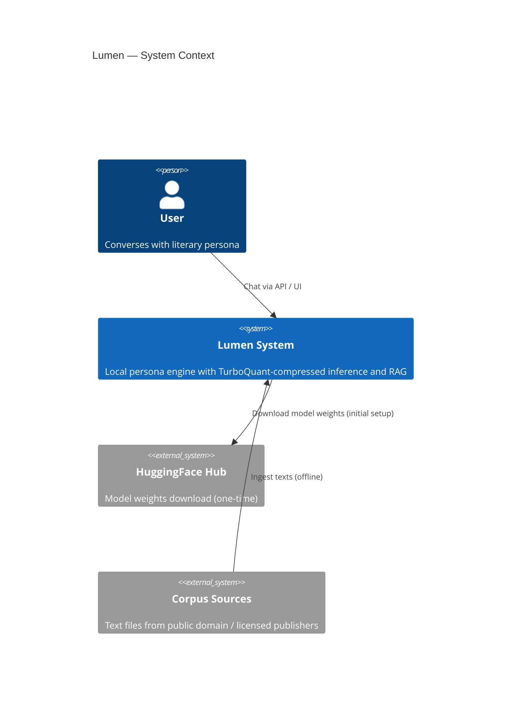
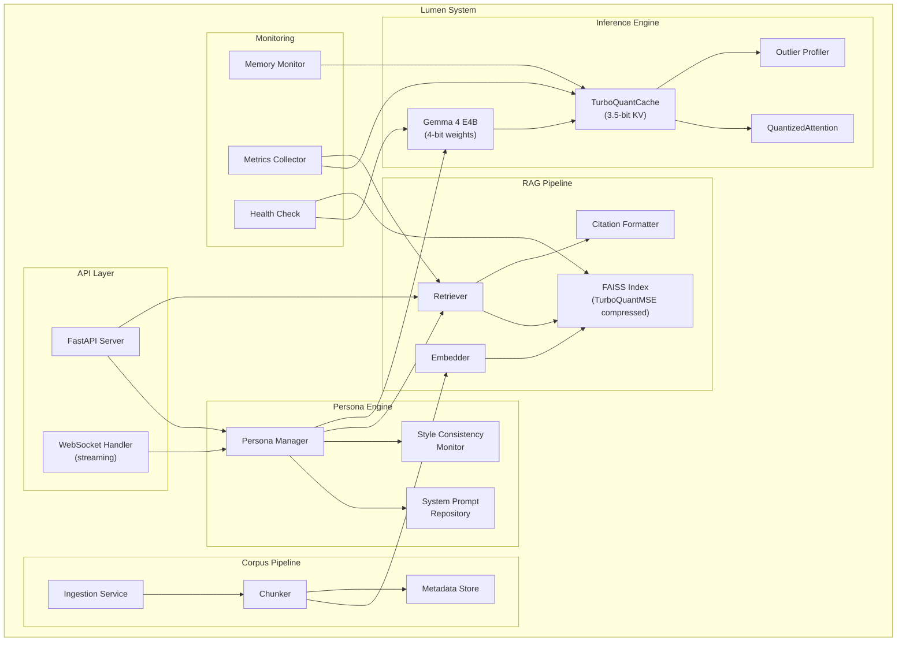

# Lumen — Architecture Specification

> **Version:** 1.0-draft
> **Date:** 2026-04-11
> **Status:** Draft — Pending Review
> **Companion documents:** [requirements.md](file:///Users/Rodrigo/CMP/lumen/specs/requirements/requirements.md) · [LUMEN_CONTEXT.md](file:///Users/Rodrigo/CMP/lumen/LUMEN_CONTEXT.md) · [project_instructions.md](file:///Users/Rodrigo/CMP/lumen/project_instructions.md)

---

## 1. System Overview

Lumen is a local-first literary persona engine that enables long-context conversations with the stylistic personas of deceased authors. The system integrates **TurboQuant vector quantization** into both the inference pipeline (KV cache compression) and the retrieval pipeline (corpus embedding compression), running entirely on consumer hardware.

### 1.1 High-Level Pipeline

```
corpus texts ──→ chunker ──→ embedder ──→ TurboQuantMSE ──→ FAISS index (inner product)
                                                                    │
user message ──→ retriever (query FAISS) ──→ top-K chunks ──→ ┐    │
                                                               │    │
                    system prompt (persona) ──────────────────→ ├──→ Gemma 4 E4B
                                                               │       │
                         conversation history ────────────────→ ┘       │
                                                                        ▼
                                                              KV cache (TurboQuantMSE 3.5-bit)
                                                                        │
                                                                        ▼
                                                                   response ──→ [optional TTS]
```

### 1.2 System Context Diagram



---

## 2. Architectural Decisions Record (ADR)

Each decision is traced to evidence from the TurboQuant paper, community implementations, and empirical benchmarks.

### ADR-1 — Use TurboQuantMSE for Both K and V

| | |
|---|---|
| **Decision** | Use `TurboQuantMSE` for both Key and Value vectors. **Do not** use `TurboQuantProd`. |
| **Status** | Accepted |
| **Context** | The TurboQuant paper (arXiv 2504.19874) recommends `TurboQuantProd` for Keys (inner-product-optimal) and `TurboQuantMSE` for Values. |
| **Evidence against paper recommendation** | scos-lab/turboquant benchmarks (GPT-2, b=4): MSE-for-both → +1.1% PPL; Paper config (Prod keys) → +6.5% PPL. turboquant-mlx (Gemma 4, D=256): `TurboQuantProd` consistently degrades quality at both D=128 and D=256. |
| **Root cause** | `TurboQuantProd`'s QJL residual correction adds **variance**. Softmax attention amplifies variance more than bias. Low-variance (MSE) beats unbiased-but-high-variance (Prod) in practice. At D=256, centroid resolution loss through softmax amplification is the specific failure mode. |
| **Gemma 4 bonus** | On Gemma 4 with head_dim=256, MSE-only **beats the fp16 baseline** in perplexity (12.05 vs 12.18, −1.1%), because rotation + quantization acts as a regularizer. |
| **Consequences** | Simpler implementation (no QJL residual path needed for KV cache). Slightly lower storage per token (no `qjl_signs` or `residual_norm` fields). |

---

### ADR-2 — 3.5-bit Uniform Bit Budget

| | |
|---|---|
| **Decision** | Use 3.5-bit uniform quantization for Gemma 4 E4B (same bit-width for K and V). |
| **Status** | Accepted |
| **Context** | K/V norm ratio determines optimal bit allocation. Models with high K/V ratio (e.g., Qwen2.5 at 106–1274x) need asymmetric bit budgets. |
| **Why uniform works for Gemma 4** | Gemma 4 sets K=V for global attention layers by design → K/V ratio ≈ 1x. According to the empirical rule (scos-lab Finding 4): K/V ratio < 10x → 3-bit uniform works. |
| **K/V Ratio Decision Table** | Applied for future model targets: |

```
K/V ratio < 10x    → 3-bit uniform works      (Gemma 4 global layers)
K/V ratio 10-60x   → 4.5-5 bit asymmetric
K/V ratio > 100x   → 5.5+ bit or mixed prec.
K/V ratio > 1000x  → TurboQuant alone insufficient
```

| **Compression result** | 5.22x vs FP16, confirmed stable across all tested prompt lengths on Gemma 4 26B (MLX benchmarks). |
| **Quality result** | Zero measurable loss at 3.5-bit on Gemma 4 E4B. |

---

### ADR-3 — Outlier-Aware Mixed Precision

| | |
|---|---|
| **Decision** | Apply 8-bit quantization to outlier Key channels (top 5–20% by RMS); use 3-bit for all remaining channels. Effective average: ~3.6 bits. |
| **Status** | Accepted |
| **Context** | scos-lab Finding 3: ~5–20% of K channels have RMS 10–100x larger than the median, especially in Layer 0. These channels contribute disproportionately to quantization error because error scales with norm². |
| **Detection strategy** | Per-layer RMS profiling at model load time. Channels with RMS > `median_rms * threshold` (threshold = 10x) are routed to 8-bit. This is a static decision per model — computed once, cached. |
| **Result on Qwen2.5-1.5B** | +2.1% PPL at 3.6 bits effective (target was 3.5-bit at 0.0%). |
| **Gemma 4 note** | K=V design means outlier disparity is expected to be lower than Qwen models. Profiling still runs at load time to confirm. |

---

### ADR-4 — FAISS Inner Product (Not Cosine)

| | |
|---|---|
| **Decision** | Use FAISS `IndexFlatIP` (inner product) for corpus vector search, not cosine similarity. |
| **Status** | Accepted |
| **Context** | TurboQuant is specifically designed for inner product preservation. The MSE-optimal quantizer minimizes `||x - Q(x)||²`, and the dequantized vectors preserve inner product with near-zero bias. |
| **Rationale** | Cosine similarity requires a post-hoc normalization step (`x / ||x||`) that partially negates the quantization design. Inner product search directly leverages TurboQuant's strengths. |
| **Consequence** | Embeddings must be generated by a model whose embedding space is meaningful under inner product (most modern embedding models satisfy this). |

---

### ADR-5 — Gemma 4 E4B as Base Model

| | |
|---|---|
| **Decision** | Use Gemma 4 E4B (4B params, dense) as the sole base model for v1.0. |
| **Status** | Accepted |
| **Rationale** | |

| Property | Value | Benefit |
|---|---|---|
| Architecture | Dense (not MoE) | Standard KV cache, no expert routing complexity |
| head_dim | 256 | Better Beta distribution concentration; d=256 codebooks yield lower MSE than d=128 |
| Attention pattern | 5:1 (5 local + 1 global) | KV cache dominated by global layers — compression benefit concentrated |
| K=V in global layers | Yes (by design) | Best case for uniform bit allocation (ADR-2) |
| Context window | 128K tokens | Sufficient for 2-hour sessions |
| Sliding window | 512 tokens (local) | Small local KV cache — minimal wasted compression overhead |
| VRAM at 4-bit | ~5 GB | Fits consumer GPU |
| TurboQuant support | Confirmed (mlx-vlm, turboquant-mlx, Incept5 benchmarks) | No integration risk |

| **Upgrade path** | 26B MoE uses the same TurboQuant integration — validated by Incept5 benchmarks showing +15–19% decode speedup at 128–256K context. |

---

### ADR-6 — Corpus Chunking at Semantic Unit Granularity

| | |
|---|---|
| **Decision** | Chunk structured works (Kardec) at the question/article level. Chunk narrative works at paragraph level with 2-paragraph overlap. |
| **Status** | Accepted |
| **Rationale** | O Livro dos Espíritos has 1,019 numbered questions — each is the minimum meaningful unit for Kardec's doctrine. Question-level chunking enables precise citation (e.g., "LdE Q.223") and cleaner RAG recall without semantic fragmentation. |
| **Chunking rules** | |

| Corpus type | Unit | Overlap | Example |
|---|---|---|---|
| Q&A structured (Kardec) | Question | None (self-contained) | `lde-q223` |
| Narrative + Q&A (O Livro dos Médiuns) | Article (334 units) | None | `ldm-a142` |
| Narrative (Emmanuel, Joanna) | Paragraph | 2 paragraphs | `emmanuel-consolador-p045` |
| Articles (Revista Espírita) | Article | None | `re-1858-01-a03` |

---

## 3. Component Architecture

### 3.1 Component Diagram



### 3.2 Component Descriptions

| Component | Responsibility | Key Interface |
|---|---|---|
| **FastAPI Server** | HTTP/WebSocket entry point for chat and search | REST + WebSocket |
| **Persona Manager** | Orchestrates persona selection, system prompt injection, RAG retrieval per turn, and response generation | `generate(user_msg, persona_id, session_id)` |
| **System Prompt Repository** | Stores curated persona prompts per author | `get_prompt(persona_id) → str` |
| **Style Consistency Monitor** | Tracks n-gram overlap with corpus across session turns to detect drift | `check_drift(response, corpus_stats) → float` |
| **Retriever** | Queries FAISS index for top-K chunks given a user message | `retrieve(query_embedding, k) → List[Chunk]` |
| **Embedder** | Generates dense embeddings for queries and corpus chunks | `embed(text) → np.ndarray` |
| **FAISS Index** | Inner product search over TurboQuantMSE-compressed corpus embeddings | `search(query, k) → (scores, ids)` |
| **Citation Formatter** | Converts chunk metadata into human-readable citations | `format(chunk) → str` |
| **Gemma 4 E4B** | Base LLM loaded with 4-bit quantized weights via HuggingFace | HuggingFace `AutoModelForCausalLM` |
| **TurboQuantCache** | Drop-in `DynamicCache`-compatible KV cache using TurboQuantMSE | HuggingFace Cache protocol |
| **QuantizedAttention** | Computes Q@K^T directly on compressed indices — no dequantization | `attention(Q, compressed_K, compressed_V) → scores` |
| **Outlier Profiler** | Detects high-RMS channels per layer at model load time; configures mixed precision | `profile(model) → Dict[layer, outlier_mask]` |
| **Ingestion Service** | Orchestrates the corpus pipeline: parse → chunk → embed → index | CLI / API |
| **Chunker** | Splits texts into semantic units with metadata | `chunk(text, strategy) → List[Chunk]` |
| **Metadata Store** | Persists chunk metadata (author, work, chapter, question, etc.) | SQLite / JSON |
| **Memory Monitor** | Reports KV cache size, compression ratio, VRAM usage | Prometheus metrics / logs |

---

## 4. Data Architecture

### 4.1 Chunk Schema

Every piece of corpus text is represented as a `Chunk` with rich metadata for citation:

```python
@dataclass(frozen=True)
class Chunk:
    id: str                    # e.g., "lde-q223", "emmanuel-consolador-p045"
    autor: str                 # e.g., "Allan Kardec"
    medium: str | None         # e.g., "Chico Xavier" (for psychographed works)
    obra: str                  # e.g., "O Livro dos Espíritos"
    parte: str | None          # e.g., "Parte Segunda — Do Mundo Espírita"
    capitulo: str | None       # e.g., "I — Os Espíritos"
    questao: int | None        # e.g., 223 (for Q&A works)
    texto: str                 # The actual text content
    edicao_referencia: str     # e.g., "FEB, 2013"
```

### 4.2 Quantized Embedding Schema

Embeddings are stored in TurboQuantMSE-compressed format:

```python
@dataclass(frozen=True)
class QuantizedMSE:
    indices: np.ndarray    # uint8 — quantized coordinate indices
    norms: np.ndarray      # float32 — original vector norms
```

**Memory layout (at 3-bit, d=256):**

| Field | Size | Notes |
|---|---|---|
| `norms` | 4 bytes | float32 per vector |
| `indices` (packed) | 96 bytes | 256 coordinates × 3 bits = 768 bits = 96 bytes |
| **Total per vector** | **100 bytes** | vs 512 bytes at FP16 (5.12x compression) |

### 4.3 KV Cache Data Structure

Each layer's KV cache is stored as `TQLayerFused`:

```python
@dataclass
class TQLayerFused:
    k_indices: torch.Tensor     # [batch, heads, seq_len, head_dim] packed uint8
    k_norms: torch.Tensor       # [batch, heads, seq_len] float32
    v_indices: torch.Tensor     # [batch, heads, seq_len, head_dim] packed uint8
    v_norms: torch.Tensor       # [batch, heads, seq_len] float32
    outlier_mask: torch.Tensor  # [heads, head_dim] bool — static per layer
    k_outlier_fp: torch.Tensor  # [batch, heads, seq_len, n_outliers] float16
    v_outlier_fp: torch.Tensor  # [batch, heads, seq_len, n_outliers] float16
```

**Memory at 128K tokens (Gemma 4 E4B, single layer, estimated):**

| Storage | FP16 baseline | TurboQuant 3.5-bit |
|---|---|---|
| K vectors | 128K × 256 × 2B = 64 MB | 128K × 100B = 12.2 MB |
| V vectors | 128K × 256 × 2B = 64 MB | 128K × 100B = 12.2 MB |
| Outlier channels (~10%) | — | 128K × 26 × 2B = 6.3 MB |
| **Total per layer** | **128 MB** | **~30.7 MB (~4.2x)** |

### 4.4 Persistence Layout

```
data/
├── models/
│   └── gemma-4-E4B-it-4bit/          # HuggingFace model weights
├── indices/
│   ├── kardec/
│   │   ├── faiss.index                # FAISS IndexFlatIP with compressed vectors
│   │   ├── metadata.json              # Chunk metadata array
│   │   └── codebook.npz               # Lloyd-Max codebook for d=embedding_dim
│   ├── emmanuel/
│   │   └── ...
│   └── joanna/
│       └── ...
├── codebooks/
│   ├── kv_d256_b3.npz                # Lloyd-Max codebook for head_dim=256, 3-bit
│   └── kv_d256_b4.npz                # Lloyd-Max codebook for head_dim=256, 4-bit
└── profiles/
    └── gemma4-e4b-outliers.json       # Per-layer outlier channel masks
```

---

## 5. Integration Contracts

### 5.1 TurboQuantCache ↔ HuggingFace Transformers

`TurboQuantCache` must implement the HuggingFace `DynamicCache` protocol to serve as a transparent drop-in replacement:

```python
class TurboQuantCache(DynamicCache):
    """
    Drop-in KV cache replacement that compresses K/V vectors
    using TurboQuantMSE at each layer's forward pass.
    """

    def __init__(self, bits: float = 3.5, outlier_threshold: float = 10.0):
        super().__init__()
        self.bits = bits
        self.outlier_threshold = outlier_threshold
        self.quantizers: Dict[int, TurboQuantMSE] = {}  # per-layer, lazy init
        self.outlier_masks: Dict[int, torch.Tensor] = {}

    def update(
        self,
        key_states: torch.Tensor,
        value_states: torch.Tensor,
        layer_idx: int,
        cache_kwargs: Optional[Dict] = None,
    ) -> Tuple[torch.Tensor, torch.Tensor]:
        """
        Called by each attention layer. Compresses K/V before storing.
        Returns dequantized K/V for the current forward pass.
        """
        ...

    def get_seq_length(self, layer_idx: int = 0) -> int: ...
    def get_max_length(self) -> Optional[int]: ...
    def reorder_cache(self, beam_idx: torch.LongTensor) -> None: ...
```

**Integration hook (monkey-patch, no model file modification):**

```python
from transformers import AutoModelForCausalLM
from turboquant.cache import TurboQuantCache

model = AutoModelForCausalLM.from_pretrained(
    "google/gemma-4-E4B-it",
    torch_dtype=torch.float16,
    device_map="auto",
    quantization_config=BitsAndBytesConfig(load_in_4bit=True),
)

# Replace default cache with TurboQuantCache
past_key_values = TurboQuantCache(bits=3.5)
outputs = model.generate(
    input_ids,
    past_key_values=past_key_values,
    max_new_tokens=512,
)
```

### 5.2 QuantizedAttention ↔ SDPA Dispatch

The `QuantizedAttention` module intercepts the standard Scaled Dot-Product Attention (SDPA) to operate directly on compressed indices, avoiding the costly dequantize-then-matmul path:

```python
class QuantizedAttention:
    """
    Computes attention scores directly on TurboQuantMSE compressed KV.

    Standard path:   Q @ dequant(K^T) → scores → softmax → @ dequant(V) → output
    Quantized path:  Q @ Pi^T → matmul(centroids[k_idx]) → scores → softmax → matmul(centroids[v_idx]) → output

    The quantized path avoids materializing full fp16 K/V tensors.
    """

    def forward(
        self,
        query: torch.Tensor,           # [batch, heads, 1, head_dim]
        k_indices: torch.Tensor,        # [batch, heads, seq_len, head_dim] uint8
        k_norms: torch.Tensor,          # [batch, heads, seq_len]
        v_indices: torch.Tensor,        # [batch, heads, seq_len, head_dim] uint8
        v_norms: torch.Tensor,          # [batch, heads, seq_len]
        centroids: torch.Tensor,        # [2^b] precomputed centroids
        rotation: torch.Tensor,         # [head_dim, head_dim] Pi matrix
    ) -> torch.Tensor:
        # 1. Rotate query into quantized space
        q_rotated = query @ rotation.T

        # 2. Compute attention scores via centroid lookup (no dequant)
        #    scores[i] = sum_d( q_rotated[d] * centroids[k_idx[i,d]] ) * k_norms[i]
        scores = centroid_matmul(q_rotated, k_indices, centroids, k_norms)

        # 3. Softmax
        attn_weights = F.softmax(scores / math.sqrt(head_dim), dim=-1)

        # 4. Compute output via centroid lookup on V
        output = centroid_matmul_v(attn_weights, v_indices, centroids, v_norms)

        # 5. Rotate output back
        return output @ rotation
```

**Attention pipeline visualization:**

```
Quantize step (at cache.update):
  x  →  normalize  →  Pi @ x_hat  →  bucketize(boundaries)  →  uint8 indices + float32 norm

Attention step (at QuantizedAttention.forward):
  Q  →  Q @ Pi^T  →  matmul(centroids[k_idx]) * k_norms  →  scores  →  softmax  →  matmul(centroids[v_idx]) * v_norms  →  @ Pi  →  output
```

### 5.3 Retriever ↔ FAISS Index

```python
class Retriever:
    def __init__(self, index_path: str, metadata_path: str):
        self.index = faiss.read_index(index_path)   # IndexFlatIP
        self.metadata = load_metadata(metadata_path) # List[Chunk]
        self.embedder = Embedder(model_name="...")

    def retrieve(self, query: str, k: int = 10) -> List[RetrievalResult]:
        """
        Returns top-K corpus chunks ranked by inner product similarity.
        """
        q_emb = self.embedder.embed(query)
        scores, ids = self.index.search(q_emb.reshape(1, -1), k)
        return [
            RetrievalResult(
                chunk=self.metadata[id],
                score=score,
                citation=format_citation(self.metadata[id]),
            )
            for score, id in zip(scores[0], ids[0])
        ]
```

### 5.4 Persona Manager ↔ All Components

The Persona Manager is the central orchestrator for each user turn:

```python
class PersonaManager:
    def generate(
        self,
        user_message: str,
        persona_id: str,
        session: Session,
    ) -> GenerationResult:
        # 1. Get persona system prompt
        system_prompt = self.prompt_repo.get_prompt(persona_id)

        # 2. Retrieve relevant corpus chunks
        chunks = self.retriever.retrieve(user_message, k=5)

        # 3. Build augmented prompt
        augmented_context = self._build_context(
            system_prompt, chunks, session.history, user_message
        )

        # 4. Generate with quantized KV cache
        response = self.llm.generate(
            augmented_context,
            past_key_values=session.kv_cache,  # TurboQuantCache
            max_new_tokens=1024,
        )

        # 5. Check style consistency
        drift_score = self.style_monitor.check_drift(
            response.text, persona_id
        )

        # 6. Format citations
        cited_response = self.citation_formatter.inject(
            response.text, chunks
        )

        return GenerationResult(
            text=cited_response,
            chunks_used=chunks,
            drift_score=drift_score,
            kv_cache_stats=session.kv_cache.stats(),
        )
```

---

## 6. TurboQuantMSE — Algorithm Internals

This section documents the algorithm as implemented in Lumen, based on Algorithm 1 from the paper.

### 6.1 Quantization Path

```
Input:  x ∈ ℝ^d  (d = 256 for Gemma 4 E4B head_dim, or d = embedding_dim for corpus)

Step 1 — Normalize:
    norm = ||x||₂
    x_hat = x / norm

Step 2 — Random Orthogonal Rotation:
    y = Pi @ x_hat
    # Pi is a d×d orthogonal matrix generated once per quantizer instance (fixed seed)
    # After rotation, each coordinate y_i follows a Beta((d-1)/2, (d-1)/2) distribution
    # At d=256, this Beta distribution is highly concentrated → near-Gaussian → Lloyd-Max codebook is very effective

Step 3 — Lloyd-Max Scalar Quantization:
    indices[i] = bucketize(y[i], boundaries)
    # boundaries and centroids are precomputed from Beta((d-1)/2, (d-1)/2) via Lloyd's algorithm
    # For b-bit: 2^b centroids, 2^b - 1 boundaries
    # These are data-oblivious — no calibration data needed

Step 4 — Store:
    QuantizedMSE(indices=uint8, norms=float32)
```

### 6.2 Dequantization Path

```
x_reconstructed = norm * Pi^T @ centroids[indices]

# Pi^T is the transpose (= inverse, since Pi is orthogonal) of the rotation matrix
# centroids[indices] maps each uint8 index back to its Lloyd-Max centroid value
```

### 6.3 Codebook Precomputation

Lloyd-Max codebooks depend only on `d` (dimension) and `b` (bits), not on data:

```python
def compute_centroids(d: int, b: int) -> Tuple[np.ndarray, np.ndarray]:
    """
    Precompute optimal centroids and boundaries for Beta((d-1)/2, (d-1)/2).
    These are fixed for a given (d, b) pair.
    """
    alpha = (d - 1) / 2
    dist = scipy.stats.beta(alpha, alpha, loc=-1, scale=2)  # range [-1, 1]
    # Run Lloyd's algorithm on this known distribution
    centroids, boundaries = lloyds_algorithm(dist, n_levels=2**b)
    return centroids, boundaries
```

**Required codebooks for Lumen:**

| Use case | Dimension (d) | Bits (b) | Codebook file |
|---|---|---|---|
| KV cache (Gemma 4 E4B) | 256 | 3 | `kv_d256_b3.npz` |
| KV cache (Gemma 4 E4B) | 256 | 4 | `kv_d256_b4.npz` |
| Corpus embeddings | embedding_dim | 3 or 4 | `emb_d{dim}_b{bits}.npz` |

> [!WARNING]
> Codebooks precomputed for d=128 (Llama/Mistral head_dim) **cannot** be reused for Gemma 4's d=256. The Beta distribution changes shape with d — using wrong codebooks will silently produce higher MSE.

### 6.4 Theoretical Distortion Bounds

From the TurboQuant paper (Table 1), normalized MSE (`E[||x - Q(x)||²] / E[||x||²]`):

| Bits | Theoretical bound | Empirical (d=1536) | Target for d=256 (≤ 1.2x bound) |
|---|---|---|---|
| 1-bit | 0.360 | 0.363 | ≤ 0.432 |
| 2-bit | 0.117 | 0.117 | ≤ 0.140 |
| 3-bit | 0.030 | 0.035 | ≤ 0.036 |
| 4-bit | 0.009 | 0.009 | ≤ 0.011 |

> [!NOTE]
> At d=256, the Beta distribution is less concentrated than at d=1536, so slightly higher empirical MSE is expected. The 1.2x tolerance margin accounts for this.

---

## 7. Deployment Architecture

### 7.1 Target Environment

```
Host: Windows + WSL2
├── Docker Engine (GPU-enabled)
│   └── docker-compose.yml
│       ├── lumen-api (FastAPI + Uvicorn)
│       │   ├── Gemma 4 E4B (4-bit, HuggingFace)
│       │   ├── TurboQuant (PyTorch + Triton kernels)
│       │   └── FAISS (CPU or GPU)
│       └── lumen-worker (optional, for async corpus ingestion)
└── NVIDIA GPU Driver (host-level)
```

### 7.2 Docker Stack

```yaml
# docker-compose.yml (conceptual)
version: "3.8"

services:
  lumen-api:
    build: .
    runtime: nvidia
    environment:
      - NVIDIA_VISIBLE_DEVICES=all
      - MODEL_ID=google/gemma-4-E4B-it
      - QUANTIZATION_BITS=3.5
      - OUTLIER_THRESHOLD=10.0
    volumes:
      - ./data/models:/app/models
      - ./data/indices:/app/indices
      - ./data/codebooks:/app/codebooks
      - ./data/profiles:/app/profiles
    ports:
      - "8000:8000"
    deploy:
      resources:
        reservations:
          devices:
            - driver: nvidia
              count: 1
              capabilities: [gpu]
```

### 7.3 Dependency Stack

```
# Runtime dependencies
OmarHory/turboquant          ← GPU quantization (PyTorch + Triton)
torch >= 2.2                 ← PyTorch with Triton support
transformers >= 4.40         ← HuggingFace model loading
bitsandbytes >= 0.43         ← 4-bit weight quantization
faiss-gpu (or faiss-cpu)     ← Vector similarity search
fastapi >= 0.110             ← API layer
uvicorn                      ← ASGI server
scipy                        ← Lloyd-Max codebook computation

# Development / validation
pytest                       ← Testing
numpy                        ← Reference computations
```

---

## 8. Known Limitations

| # | Limitation | Impact | Mitigation |
|---|---|---|---|
| **L1** | Paper reports 8x attention speedup; OmarHory implementation achieves **1.85x** | Decode speedup is modest, especially at short contexts (<16K) | Acceptable — primary benefit is **memory** compression (5x), not speed. Speed benefit grows at 128K+ context. |
| **L2** | Authors' optimized CUDA kernels **not publicly released** | Cannot reproduce paper's speed claims | Use OmarHory Triton kernels. Monitor llama.cpp CUDA kernel PR for potential improvement. |
| **L3** | llama.cpp TurboQuant integration **pending merge** (April 2026) | Cannot use GGUF/llama.cpp path yet | Use HuggingFace Transformers path. Monitor [discussion #20969](https://github.com/ggml-org/llama.cpp/discussions/20969). |
| **L4** | `TurboQuantProd` degrades quality on Gemma 4 at D=256 | Cannot use paper's recommended K quantizer | Use `TurboQuantMSE` for both (ADR-1) — empirically superior. |
| **L5** | Gemma 4 global attention layers with head_dim=512 (some configs) fall through to TILE FA kernel | Quantization may be less effective on these layers | TILE fallback acts as effective layer dropout — less harmful than structured noise (llama.cpp finding). |
| **L6** | TurboQuant decode speedup is **negative on E2B** | Very small models lose more to quantization overhead than they gain | Not applicable — Lumen targets E4B, where speedup is positive at long contexts. |
| **L7** | Licensed corpora (Emmanuel/FEB, Joanna/LEAL) require **license verification** | Cannot distribute compressed indices of these works without authorization | Verify licenses during Phase 2. Public domain works (Kardec) are unaffected. |

---

## 9. Validation Architecture

All architectural decisions must be validated before production deployment. The validation suite is organized in three tiers:

### Tier 1 — Algorithm Correctness

```bash
# OmarHory/turboquant benchmark suite — 30 distortion checks
python -m benchmarks.validate_algorithms

# Lumen-specific: head_dim=256 codebook validation
python -m evals.turboquant_eval --dim 256 --bits 3 4
# Must show MSE within 1.2x of paper bounds
```

### Tier 2 — KV Cache Integration

```bash
# Memory compression measurement
python -m evals.kv_cache_eval --model gemma-4-E4B --context-length 128000
# Target: ≥ 5x compression, < 1% PPL degradation

# Needle-in-haystack on Kardec corpus
python -m evals.kv_cache_eval --needle --lengths 4096 16384 65536 131072
# Target: > 95% recall at all lengths
```

### Tier 3 — Persona Quality

```bash
# Style fidelity and RAG accuracy
python -m evals.persona_eval --persona kardec --turns 50
# Target: < 5% n-gram overlap drift, > 90% citation precision

# Citation precision on known questions
python -m evals.persona_eval --citation-test --dataset lde-50-questions
# Target: > 90% correct LdE question cited
```

### Regression Rule

> [!IMPORTANT]
> Any change to the quantizer, codebook, or attention path **must** include a diff of all three eval tiers in the PR. No merge without documented metric comparison.

---

## 10. References

| Document | Path / URL |
|---|---|
| Requirements Specification | [requirements.md](file:///Users/Rodrigo/CMP/lumen/specs/requirements/requirements.md) |
| Lumen Technical Context | [LUMEN_CONTEXT.md](file:///Users/Rodrigo/CMP/lumen/LUMEN_CONTEXT.md) |
| Project Instructions | [project_instructions.md](file:///Users/Rodrigo/CMP/lumen/project_instructions.md) |
| TurboQuant Paper | [arXiv 2504.19874](https://arxiv.org/abs/2504.19874) |
| PolarQuant Paper | [arXiv 2502.02617](https://arxiv.org/abs/2502.02617) |
| QJL Paper | [arXiv 2406.03482](https://arxiv.org/abs/2406.03482) |
| OmarHory/turboquant (GPU) | [GitHub](https://github.com/OmarHory/turboquant) |
| scos-lab/turboquant (reference) | [GitHub](https://github.com/scos-lab/turboquant) |
| turboquant-mlx (Apple Silicon) | [GitHub](https://github.com/sharpner/turboquant-mlx) |
| Incept5/gemma4-benchmark | [GitHub](https://github.com/Incept5/gemma4-benchmark) |
| llama.cpp TurboQuant | [Discussion #20969](https://github.com/ggml-org/llama.cpp/discussions/20969) |
| Gemma 4 Documentation | [Google AI](https://ai.google.dev/gemma/docs/core) |
| HuggingFace Gemma 4 Blog | [HuggingFace](https://huggingface.co/blog/gemma4) |

---

## 11. Quick Reference — Key Numbers

| Metric | Target | Source |
|---|---|---|
| MSE at 3-bit, d=256 | ≤ 0.035 | TurboQuant paper Table 1 (1.2× tolerance for d=256 vs d=1536) |
| MSE at 4-bit, d=256 | ≤ 0.011 | TurboQuant paper Table 1 (1.2× tolerance) |
| KV cache compression ratio | ≥ 5× vs FP16 | Requirements spec, confirmed on Gemma 4 |
| Real attention speedup | ~1.85× | OmarHory/turboquant benchmarks (not the paper's 8×) |
| PPL degradation at 3.5-bit | < 1% | Requirements spec |
| RAG Recall@10 | > 0.90 | Requirements spec |
| Citation precision | > 90% | Requirements spec (50 known LdE questions) |
| NIHS recall | > 95% at 4K/16K/64K/128K | Requirements spec |
| Style drift over 50 turns | < 5% n-gram deviation | Requirements spec |
| Gemma 4 E4B context window | 128K tokens | Google Gemma 4 docs |
| Gemma 4 E4B head_dim | 256 | Model config (not 128 like Llama/Mistral) |
| Gemma 4 E4B local:global attention ratio | 5:1 | Model architecture |
| LdE questions | 1,019 | Corpus analysis |
| LdM articles | 334 | Corpus analysis |
| Memory per 3-bit vector (d=128) | 52 bytes (4B norm + 48B packed) | OmarHory implementation |
